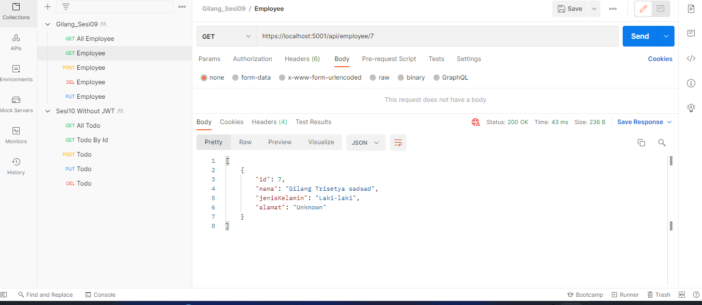

# Identitas
1. Nama : Gilang Trisetya Indrawan
2. Kode Peserta : FSDO002ONL018

# Cara Memakai Aplikasi Menggunakan Postman
1. Run menggunakan dotnet run 
3. Database yang digunakan MySql Xampp
4. import kolesi postman aplikasi ini  https://www.getpostman.com/collections/539d774bf773ad6394e8
5. Create
   - membuat akun Employee 
6. Read
   - Mendapatkan semua Employee 
   - Mendapatkan employee By Id 
7. Update
   - Update employee by id 
8. Delete
   - Delete employee by id  

